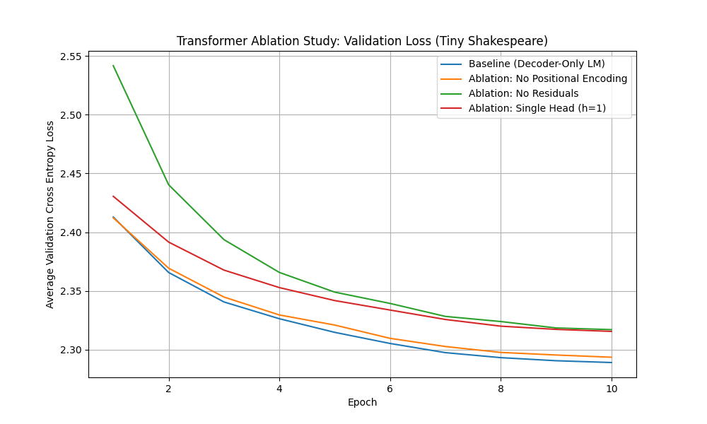

# Transformer 消融研究 (Ablation Study)

本项目从零实现了一个基于 Transformer 架构的仅解码器（Decoder-Only）语言模型，并在 Tiny Shakespeare 数据集上进行了训练。项目的主要目的是通过一系列消融实验，探究 Transformer 关键组件（位置编码、残差连接、多头注意力）的必要性。

## 项目结构

```
transformer-ablation/
├── .gitignore
├── README.md
├── requirements.txt
├── results/
│   └── ablation_study_loss_curve.png  (最终产出的图表)
├── scripts/
│   ├── prepare_data.sh (下载数据脚本)
│   └── run.sh (复现所有实验的脚本)
└── src/
    ├── data_utils.py   (数据加载与批处理)
    ├── main.py         (主训练入口)
    ├── model.py        (Transformer 模型定义)
    └── utils.py        (辅助函数，如设置随机种子)
```

## 硬件要求

* **CPU**: 可以运行。
* **GPU**: 在 NVIDIA GPU（如 RTX 3060 或 T4）上，所有实验（共 4 个）预计可在 15-30 分钟内完成。
* **内存**: > 8 GB RAM

## 如何复现实验

**1. 克隆仓库**
```bash
git clone [https://github.com/](https://github.com/)[您的用户名]/[您的仓库名].git
cd transformer-ablation
```

**2. 创建环境并安装依赖**
```bash
# 创建虚拟环境
python -m venv .venv
source .venv/bin/activate  # (Windows: .venv\Scripts\activate)

# 安装依赖
pip install -r requirements.txt
```

**3. 运行所有实验**

我们提供了一个脚本来自动下载数据、按顺序运行所有 4 个实验（使用固定的随机种子 `42`），并生成最终的对比图表。

```bash
# 赋予脚本执行权限
chmod +x scripts/prepare_data.sh scripts/run.sh

# 运行！
bash scripts/run.sh
```

所有实验（Baseline, No PE, No Residuals, Single Head）将依次运行。

**4. 查看结果**

训练完成后，您将在 `results/` 目录下找到最终的对比图：
* `results/ablation_study_loss_curve.png`

---

### 运行单个实验

如果您想单独运行某个实验（例如，使用不同的超参数）：

```bash
# 确保数据已下载
bash scripts/prepare_data.sh

# 运行基准实验 (Exact 命令行)
python src/main.py --experiment baseline --seed 42 --epochs 10 --lr 3e-4

# 运行无位置编码实验
python src/main.py --experiment no_pe --seed 42 --epochs 10 --lr 3e-4
```

## 实验结果



*(在这里可以添加您对图表的分析和结论)*